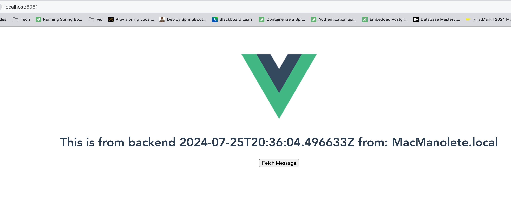

# Evolución Back Front

La finalidad de este repositorio es la de tener varios ejemplos de como poder tener desplegados un backend y un frontend en el equipo.

## Comunicación directa conociendo IPs y puertos

### Backend

El backend es una simple API que responderá a _/hello_
devolviendo un saludo indicando la hora y el host desde el que se ha hecho la petición

```shell
curl http://localhost:8080/hello
```

nos devolvería el mensaje

```
This is from backend 2024-07-25T20:33:48.720220Z from: MacManolete.local
```

### Frontend

El frontend es una simple aplicación construida en vue3 que se encargará de tener una pantalla donde a través de un botón se pueda hacer una petición via FETCH al backend y mostrarlo por pantalla



### Pasos

1. Crear el backend haciendo que el puerto sea el 8080
2. Ejecutar la aplicación
   ```shell
   mvn spring-boot:run
   ```
3. Se podría ejecutar un curl para var que se accede
   ```shell
   curl http://localhost:8080/hello
   ```
4. En el proyecto de front, bastaría levantarlo en modo testing
   ```shell
   npm run serve
   ```
5. Y al acceder a la applicación por http://localhost:8081 podríamos acceder a la aplicación
6. Hay que recalcar que esto funciona ya que el fetch se está haciendo directamente al servicio de backend

```javascript
fetch("http://localhost:8080/hello")
  .then((response) => response.text())
  .then((data) => {
    this.message = data;
    console.log("Response text:", data);
  })
  .catch((error) => {
    console.error("Error fetching the message:", error);
  });
```
