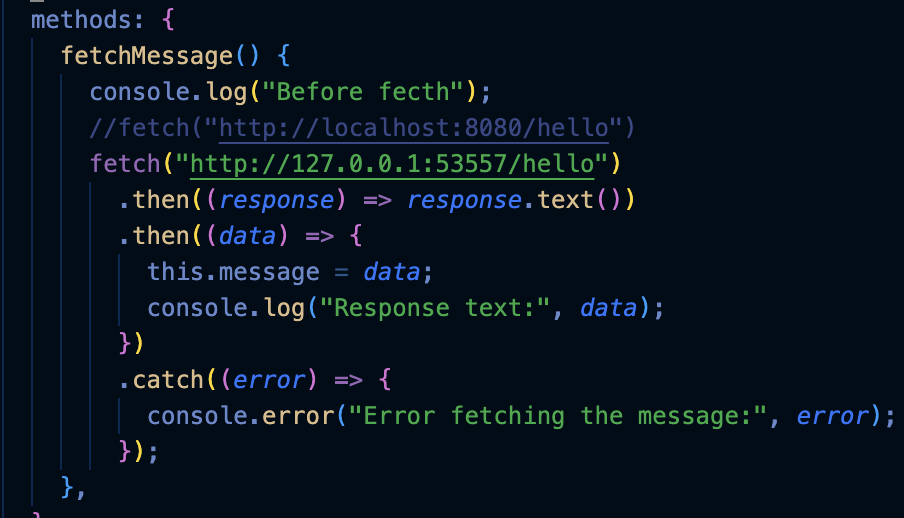
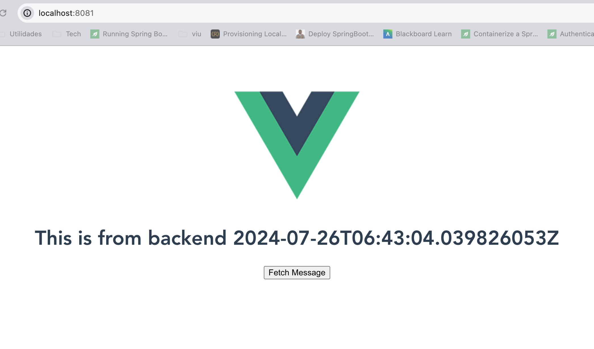

# Despliegue del backend mediante minikube

En esta solución nos iremos acercando al resultado final esperado que será desplegar backend y frontend en local bajo minikube simulando un despliegue real en kubernetes.

En esta opción vamos a utilizar un manifiesto para el backend

## Pasos

1. Arrancar minikube

```bash
minikube start
```

2. Hacer que Docker trabaje dentro de minikube

```bash
eval $(minikube docker-env)
```

3. Construir la imagen docker

```bash
docker built -t backapp:v3 .
```

4. Crear el manifiesto creando tanto la parte del deployment como la parte del servicio

```yaml
apiVersion: apps/v1
kind: Deployment
metadata:
  name: backapp-deployment
spec:
  selector:
    matchLabels:
      app: backapp
  replicas: 1
  template:
    metadata:
      labels:
        app: backapp
    spec:
      containers:
        - name: backapp
          image: backapp:v3
          imagePullPolicy: IfNotPresent
          ports:
            - containerPort: 8080

---
apiVersion: v1
kind: Service
metadata:
  name: backapp-service
spec:
  ports:
    - protocol: "TCP"
      port: 8080 # The port inside the cluster
      targetPort: 8080 # The port exposed by the service
  type: NodePort # Type of service
  selector:
    app: backapp
```

5. Crear el servicio haciendolo de tipo NodePort

```bash
kubectl expose deployment backapp --type=NodePort
```


6. Obtener la url del servicio

```bash
minikube service backapp
```


7. Copiamos la url que nos devuelve el paso anterior y lo ponemos en frontapp
   

8. Lanzamos el comando para desplegar la aplicación front

```bash
npm run serve
```


